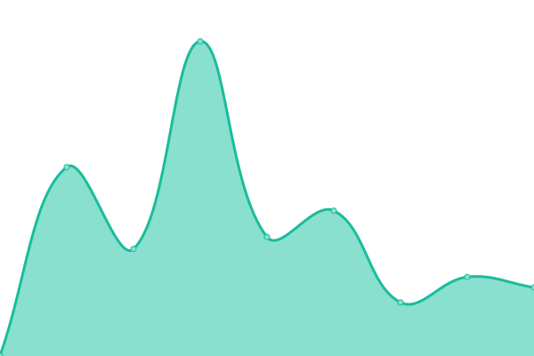
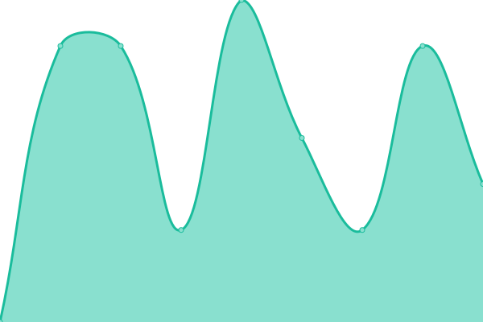

# [📈 Live Status](https://status.alxhu.de): <!--live status--> **🟥 Complete outage**

This repository contains the open-source uptime monitor and status page for [Upptime](https://upptime.js.org), powered by [Upptime](https://github.com/upptime/upptime).

With [Upptime](https://upptime.js.org), you can get your own unlimited and free uptime monitor and status page, powered entirely by a GitHub repository. We use [Issues](https://github.com/upptime/upptime/issues) as incident reports, [Actions](https://github.com/upptime/upptime/actions) as uptime monitors, and [Pages](https://status.alxhu.de) for the status page.

<!--start: status pages-->
<!-- This summary is generated by Upptime (https://github.com/upptime/upptime) -->
<!-- Do not edit this manually, your changes will be overwritten -->
<!-- prettier-ignore -->
| URL | Status | History | Response Time | Uptime |
| --- | ------ | ------- | ------------- | ------ |
|  [alxhu-Statuspage (IPv4)](https://status.alxhu.de) | 🟥 Down | [alxhu-statuspage-i-pv4.yml](https://github.com/alxhu-dev/status.alxhu.de/commits/HEAD/history/alxhu-statuspage-i-pv4.yml) | 

 0ms
     
 | 

<a href="https://status.alxhu.de/history/alxhu-statuspage-i-pv4">0.14%</a>
    

|  [alxhu-Statuspage (IPv6)](https://status.alxhu.de) | 🟥 Down | [alxhu-statuspage-i-pv6.yml](https://github.com/alxhu-dev/status.alxhu.de/commits/HEAD/history/alxhu-statuspage-i-pv6.yml) | 

 0ms
     
 | 

<a href="https://status.alxhu.de/history/alxhu-statuspage-i-pv6">0.17%</a>
    

|  [alxhu-YouTube (IPv4)](https://alxhu.de) | 🟥 Down | [alxhu-you-tube-i-pv4.yml](https://github.com/alxhu-dev/status.alxhu.de/commits/HEAD/history/alxhu-you-tube-i-pv4.yml) | 

 0ms
     
 | 

<a href="https://status.alxhu.de/history/alxhu-you-tube-i-pv4">28.74%</a>
    

|  [alxhu-YouTube (IPv6)](https://alxhu.de) | 🟥 Down | [alxhu-you-tube-i-pv6.yml](https://github.com/alxhu-dev/status.alxhu.de/commits/HEAD/history/alxhu-you-tube-i-pv6.yml) | 

 0ms
     
 | 

<a href="https://status.alxhu.de/history/alxhu-you-tube-i-pv6">42.08%</a>
    

|  [alxhu-Home (IPv4)](https://home.alxhu.de) | 🟥 Down | [alxhu-home-i-pv4.yml](https://github.com/alxhu-dev/status.alxhu.de/commits/HEAD/history/alxhu-home-i-pv4.yml) | 

 0ms
     
 | 

<a href="https://status.alxhu.de/history/alxhu-home-i-pv4">39.11%</a>
    

|  [alxhu-Home (IPv6)](https://home.alxhu.de) | 🟥 Down | [alxhu-home-i-pv6.yml](https://github.com/alxhu-dev/status.alxhu.de/commits/HEAD/history/alxhu-home-i-pv6.yml) | 

 0ms
     
 | 

<a href="https://status.alxhu.de/history/alxhu-home-i-pv6">62.34%</a>
    

<!--end: status pages-->

[**Visit our status website →**](https://status.alxhu.de)

## 📄 License

- Powered by: [Upptime](https://github.com/upptime/upptime)
- Code: [MIT](./LICENSE) © [Anand Chowdhary](https://anandchowdhary.com), supported by [Pabio](https://pabio.com)
- Data in the `./history` directory: [Open Database License](https://opendatacommons.org/licenses/odbl/1-0/)
